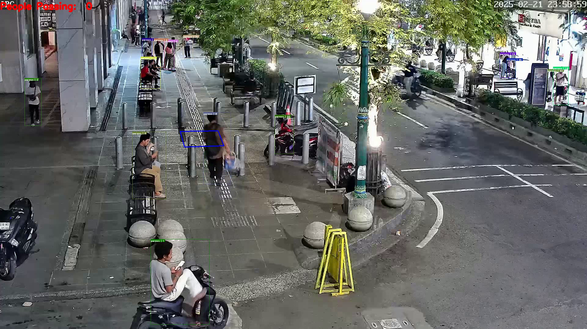
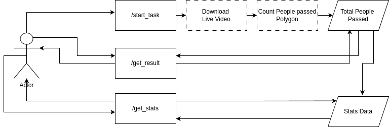
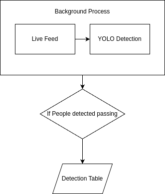
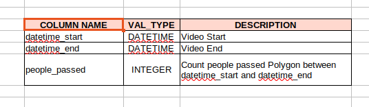
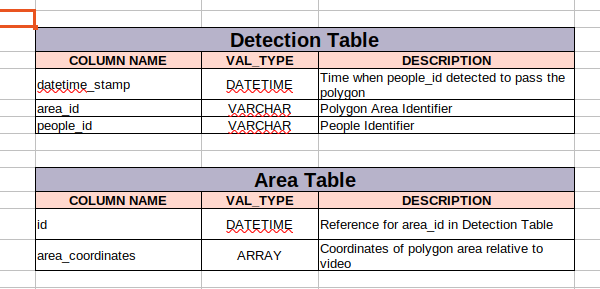

# People Counting in Polygon Area



## Overview
This project counts people passing through a defined polygon area using CCTV feeds from [cctv.jogjakota.go.id](https://cctv.jogjakota.go.id). The current focus is on the **North Malioboro CCTV**.

---

## Installation
To set up the project, pull the Docker image:
```sh
docker pull rayhantitho/count-people-fastapi_app:latest
docker run -d -p 8000:8000 rayhantitho/count-people-fastapi_app:latest
```

---

## Inference
For inference, refer to the Jupyter Notebook:
- **[test-count-people-api.ipynb](./test-count-people-api.ipynb)**

### Inference Demo
Example results can be found in the **[inference-example](./inference-example)** folder.

---

## System Design
### Prototype Design

> *Currently, this is a prototype version, but the goal (To-Be) is to have background processes.*

### To-Be Design

> *This is the To-Be Design.*

---

## Database Design

> *This schema explain the prototype design. Since we do detection part by part, so we need the starttime and endtime.*


> *This is the to-be design Since we have always running background process detection, we can record when people passed the polygon.*

---

## Detection Algorithm
- **Detection Model**: YOLOv5s
- **Object Tracking**: Simple Online Realtime Tracking (SORT)
- **Passing Condition**: A person is counted as passing if the **bottom-most point** of their bounding box enters the polygon area at least once.

---

## Get a Longer Dataset
To collect more data, modify the dataset download script:
- Open **[cctv-download-dataset.ipynb](./cctv-download-dataset.ipynb)**
- Adjust the range in the loop:
  ```python
  tqdm(range(300))  # Increase this value to get more data
  ```
  You can increase the number significantly if you have time.

---

## Checklist
- Design Database (Done)
- Pengumpulan Dataset (Done)
- Object Detection & Tracking (Done)
- Counting & Polygon Area (Done)
- Prediksi (Forecasting) (X): Built a dashboard but have not incorporated prediction yet due lack of data
- Integrasi API (Done)
- Deployment (Done)

## Author
**Rayhan Titho**

For questions or collaborations, reach out via GitHub or email me at rayhantithokharisma@gmail.com.


